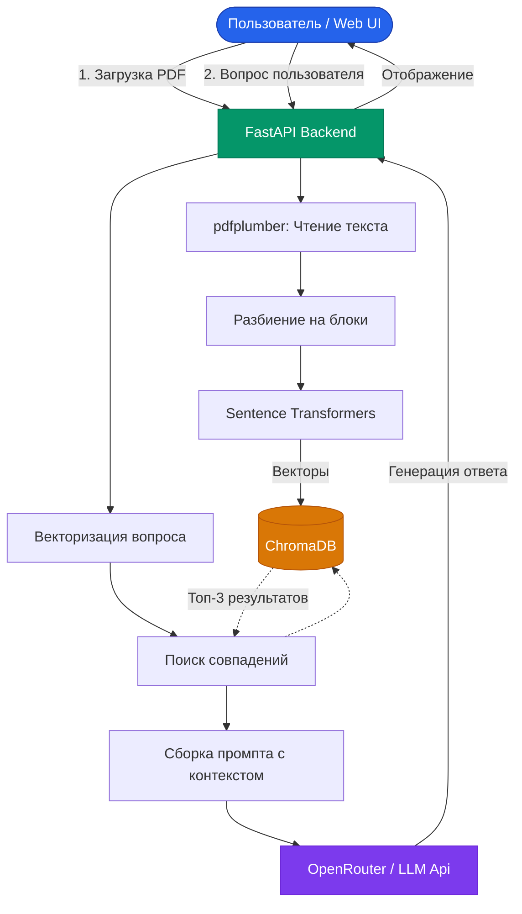
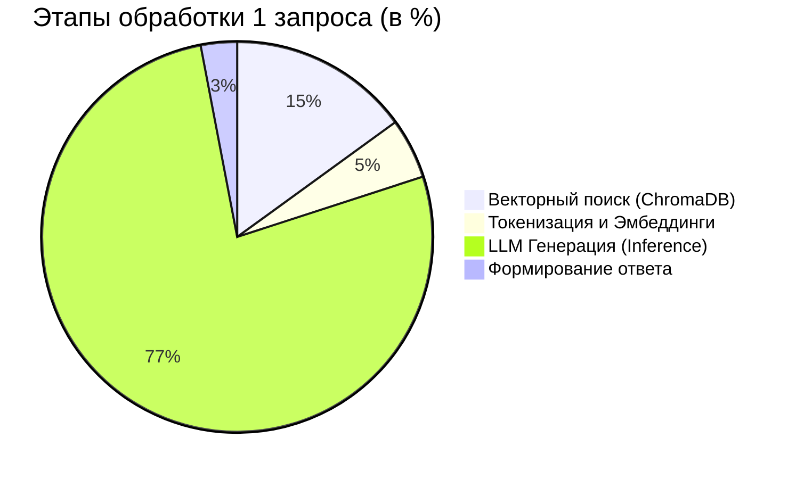

# Falal RAG Assistant

[](https://huggingface.co/spaces/snow1e77/falal-rag)

Современная система Retrieval-Augmented Generation (RAG) с интуитивно понятным веб-интерфейсом в стиле ChatGPT. Позволяет загружать PDF-документы и общаться с большой языковой моделью (LLM), которая отвечает строго на основе предоставленного контекста.

## 📊 Анализ эффективности системы (Для комиссии)

### Сравнение: Обычная LLM против RAG Архитектуры

| Критерий анализа | Обычная LLM (ChatGPT и др.) | Наше RAG-решение |
| :--- | :--- | :--- |
| **Источники данных** | Общие знания из обучающей выборки | Доверенные документы пользователя (PDF-файлы) |
| **Риск "галлюцинаций"** | Высокий (модель может придумывать факты) | **Низкий** (строгая опора на контекст базы данных) |
| **Актуальность** | Ограничена датой обучения модели | **Всегда свежая** (информация берется из новых файлов) |
| **Приватность** | Данные могут утекать в чужие сессии | **Изолированная среда** (уникальный `chat_id` для документов) |

### Архитектура: Как работает система



### Распределение времени стадии Inference



## 🚀 Особенности

- **Анализ PDF**: Извлечение текста из PDF-файлов любой сложности с помощью `pdfplumber`.
- **Умный поиск (RAG)**: Использование локальной векторной базы данных **ChromaDB** и `sentence-transformers` для мгновенного поиска релевантных кусков текста.
- **Интеграция с LLM**: Работает через API OpenRouter (используется мощная бесплатная модель `nvidia/nemotron-3-super-120b-a12b:free`, что можно легко изменить в `main.py`).
- **Изолированные контексты**: Поддержка раздельных сессий (чатов), так что документы одного чата не смешиваются с другими.
- **Современный UI**: Темная тема, адаптивная верстка, микроанимации и красивое форматирование Markdown, вдохновленное лучшими практиками современного веб-дизайна (Vanilla JS + CSS).

## 🛠 Технологический стек

* **Backend**: FastAPI, Python 3
* **RAG Engine**: ChromaDB, Sentence-Transformers, pdfplumber
* **LLM API**: OpenAI SDK (настроенный на OpenRouter)
* **Frontend**: Vanilla HTML / CSS / JavaScript

## 📦 Установка и запуск (Локально)

1. **Клонируйте репозиторий:**
   ```bash
   git clone https://github.com/твое_имя_пользователя/rag-urfu.git
   cd rag-urfu
   ```

2. **Создайте и активируйте виртуальное окружение:**
   ```bash
   python -m venv venv
   # Для Windows:
   venv\Scripts\activate
   # Для Mac/Linux:
   source venv/bin/activate
   ```

3. **Установите зависимости:**
   ```bash
   pip install -r requirements.txt
   ```

4. **Настройте переменные окружения:**
   Создайте файл `.env` в корневой папке проекта и добавьте ваш ключ от OpenRouter:
   ```env
   OPENROUTER_API_KEY=ваш_ключ_здесь
   ```
   *(Ключ можно получить бесплатно на сайте [OpenRouter](https://openrouter.ai/))*

5. **Запустите сервер:**
   ```bash
   uvicorn main:app --reload
   ```

6. Откройте браузер и перейдите по адресу: [http://localhost:8000](http://localhost:8000)

## 🗂 Структура проекта

* `main.py` - Основной код приложения FastAPI (роутинги, сервер).
* `rag_engine.py` - Логика RAG (разделение текста на чанки, работа с векторами, ChromaDB).
* `static/` - Папка с фронтендом (index.html, стили, скрипты).
* `requirements.txt` - Список Python-зависимостей.
* `.env` - Файл конфигурации (не попадает в Git, см. настройки).

## 👨‍💻 Автор
Разработано для портфолио и приема комиссии.
